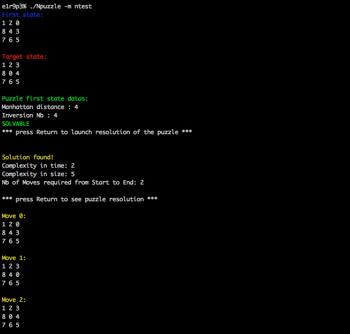

# N-puzzle
A star algorithm implementation in C++ on Npuzzle board games.

Duration: two weeks

The goal of this project was to resolve N-puzzle (also known as taquin) by implementing the A star algorithm or one of its variants in a team of two. 
We had to resolve puzzle of at least size 3, and our program can resolve up to size ~4-5 depending on its settings. 
Undoubtedly, A star algorithm is very powerful. For the N puzzles, we considered each state of the puzzle as a "node", let's say the equivalent of a position on a game map. For each state, we generate the child states until one of these child is the result we are looking for (the resolved n puzzle). 
The twist is that the A star orients the exploration of these child states, depending on if we are closer to the end or not. 

At each step, we explore a new state, a new "node", and we retain the number of moves from the beginning to this node, and apply a heuristic that will give us a value that represent the level of interest of the node. 

If we were to retain only the number of moves from the beginning when selecting the state to explore, the search would be a Djikstra algorithm, meaning it would go through every possible solution until it finds the result, assuring us the shortest path from the beginning to the end, at the cost of a long research time. 

If we were to follow only the heuristic value for each states, the program would find the end very quickly, be the path could not be the shortest, as the search only search for the most interesting child without looking at its move cost. That is the greedy best first search. 

A star is powerful in the sense that it takes the best of these two search methods to select the node with the most interesting heuristic value, all the while looking at the one with the shortest path when possible. The speed is then acceptable, and the shortest path is always found.
